# Container Images

     
    
     
     
    <noscript></noscript>

---

All Dockefiles are automatically generated 

Do not try to change anything live on the repository

All changes are made from our own CI Pipline ( unpublic ) 

---

We are out of the dev version.

All Containers can be used without breaking.

You can use all with dockserver

Don't use the images / dockers on other projects
This should not work for you.

--- 

## Before open a feature request/ pull_request or issues

1. We don't accept pull_request for other projects.
1. We don't accept any changes what breaks dockserver.
1. We don't give any help for other projects to run this dockers.

---

## Notice Alpine Builds

1. radarr
1. sonarr
1. sabnzbd
1. lidarr
1. readarr
1. bazarr
1. duplicati
1. And many more......

More and more dockers will use **alpine** as base image

## What that's all ?!

Nope... we have build our own CI/CD PIPLINE 

It's runs inside of a isolated Container environment 

Specs :

(( SELF HOSTED ))

I9-9900k

64GB RAM

1 DATACENTER NVME 512GB

*( isolated docker based github runner ))

---

## Some hidden Updates are pushed

We provide as next some hidden scripts to build

the docker images based of a json / shell file 

(( runs since 4 weeks now )) 

Also we have added a new layer for check of any breaches.

Next what is also added :

one dependencies script to pull the latest versions of every dependencies what is used inside of the docker

## push to public ?!  And show the code ??

No way ..... 

We didn't show them , 
since I know some other are stealing here,

Without given any credits or respect

--- 

## Ideas and Code

This repository is heavily based on 

[Linuxserver.io](https://linuxserver.io) images and [k8s-at-home](https://k8s-at-home.com/) idea

All Containers have some additional edits just for dockserver.io

Please check before you run it on other systems

---

And the best is 

Fuck XOXO SBOX stealing code to get your product up and running is a bitch move

---

SOME fancy stats 

---

Own Builded Containers

#JsonSchema#
